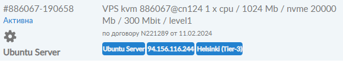
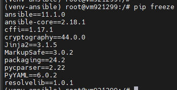
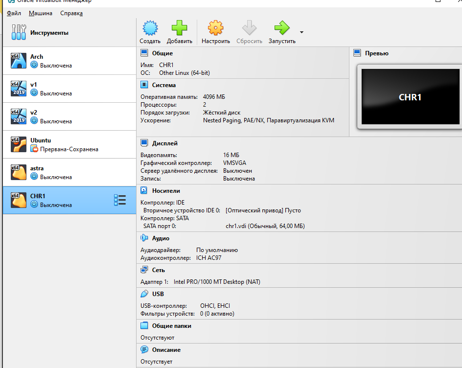
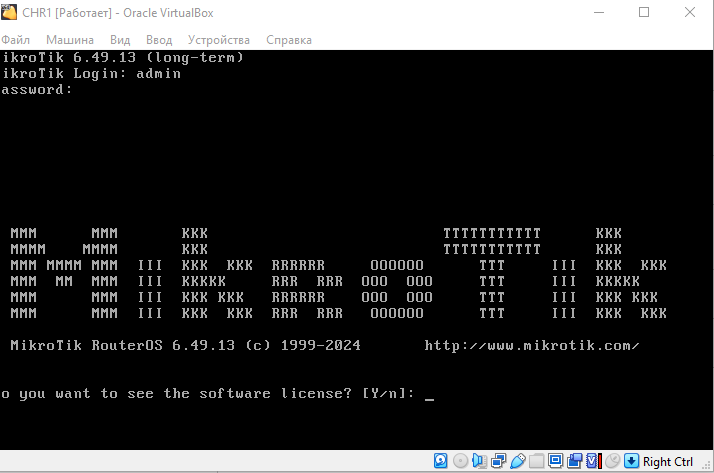
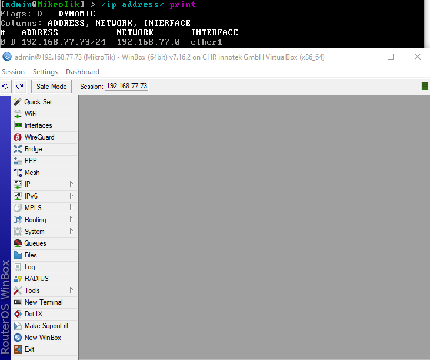
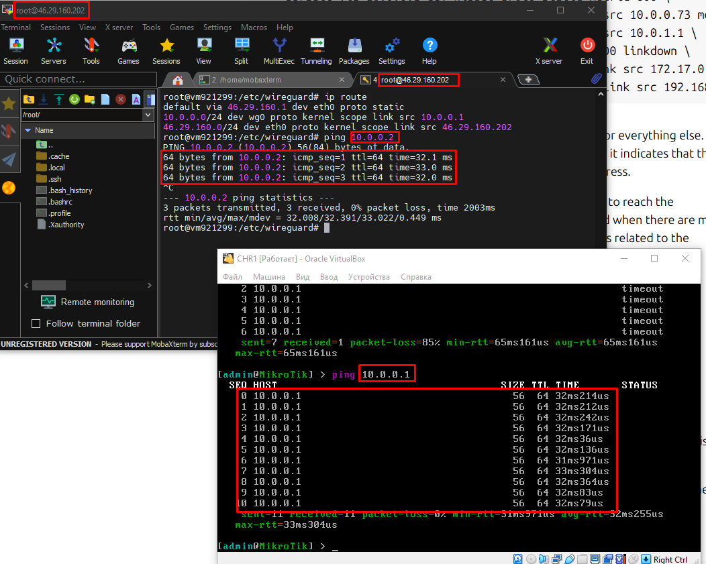

University: [ITMO University](https://itmo.ru/ru/)  
Faculty: [FICT](https://fict.itmo.ru)  
Course: [Network programming](https://github.com/itmo-ict-faculty/network-programming)  
Year: 2024/2025  
Group: K34212  
Author: Shelyagov Alexey  
Lab: Lab1  
Date of create: 27.12.2024  
Date of finished: 27.12.2024 

## Лабораторная работа №1 "Установка CHR и Ansible, настройка VPN"

## Описание

Данная работа предусматривает обучение развертыванию виртуальных машин (VM) и системы контроля конфигураций Ansible а также организации собственных VPN серверов.

## Цель работы

Целью данной работы является развертывание виртуальной машины на базе платформы Microsoft Azure с установленной системой контроля конфигураций Ansible и установка CHR в VirtualBox

## Ход работы

Перед выполнением данной работы был арендован VPS через сервиc JustHost.



Для начала были установлены необходимые для лабораторной работы паккеты, а именно python3 и Ansible



Затем, был установлен VirtualBox, а на него CHR (RouterOS)



Установка была произведенва успешно.


На сервре был установлен wireguard-инструменты c посошью команды:

```
apt install -y wireguard
```
Сгенерированы SSH-ключи:

```
wg genkey | tee /etc/wireguard/privatekey | wg pubkey | tee /etc/wireguard/publickey
```

Через VIM изменен конфиг сервера:

```
[Interface]
PrivateKey = <privatekey>
Address = 10.0.0.1/24
ListenPort = 443
PostUp = iptables -A FORWARD -i %i -j ACCEPT; iptables -t nat -A POSTROUTING -o eth0 -j MASQUERADE
PostDown = iptables -D FORWARD -i %i -j ACCEPT; iptables -t nat -D POSTROUTING -o eth0 -j MASQUERADE

[Peer]
PublicKey = *Здесь ключ, сгенерированный в графическом интерфейсе CHR*
AllowedIPs = 10.0.0.2/32

```
Запущет сервер командами:

```
systemctl enable wg-quick@wg0.service
systemctl start wg-quick@wg0.service
```

Клиентская часть wireguard тунеля настраивалась через web-интерфейс сервера с помощью WinBox.



В результате мы можем видеть успешность пингов между сервером и клиентом.



## Вывод

В ходе выполнения лабораторной работы был арендован VPS через платформу JustHost, на нем установлены python3 и система контроля конфигураций  Ansible, также была поднята виртуальная машина CHR(RouterOS) в VirtualBox. Между данными устройствами был построен WireGuard тунель
