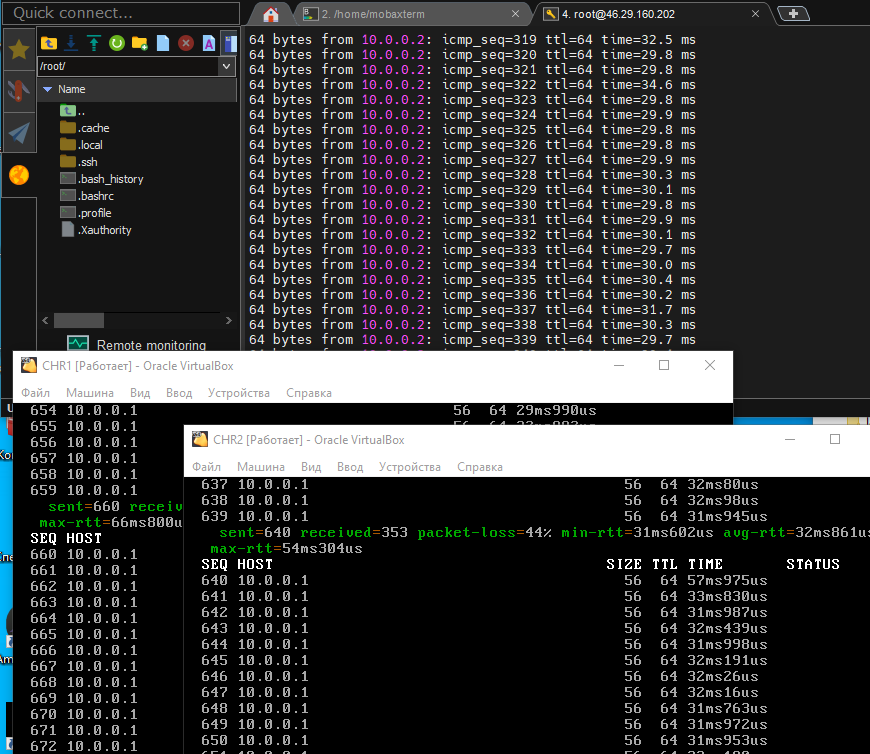
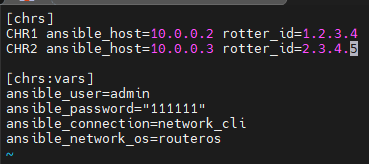
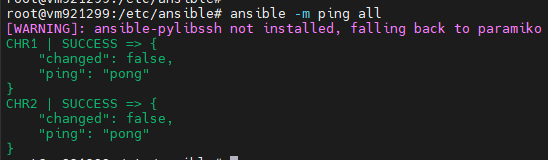
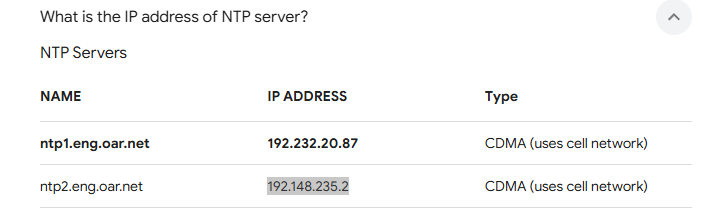
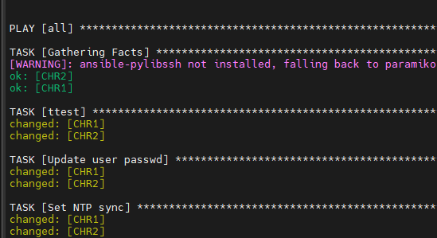
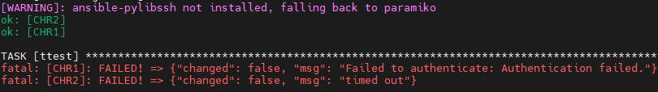

University: [ITMO University](https://itmo.ru/ru/)  
Faculty: [FICT](https://fict.itmo.ru)  
Course: [Network programming](https://github.com/itmo-ict-faculty/network-programming)  
Year: 2024/2025  
Group: K34212  
Author: Shelyagov Alexey  
Lab: Lab2  
Date of create: 27.12.2024  
Date of finished: 27.12.2024 

## Лабораторная работа №2 "Развертывание дополнительного CHR, первый сценарий Ansible"

## Описание

В данной лабораторной работе вы на практике ознакомитесь с системой управления конфигурацией Ansible, использующаяся для автоматизации настройки и развертывания программного обеспечения.

## Цель работы

С помощью Ansible настроить несколько сетевых устройств и собрать информацию о них. Правильно собрать файл Inventory.

## Ход работы

Сначала был поднят второй CHR(RouterOS) и  настроен аналогичным образом. Ниже видны результаты успешной настройки.



Затем, был настроен Inventory-файл.



И проверена правильность его настройки.



Были выбраны следующие адреса общедоступных NTP-серверов.



Затем был написан конфиг, настраивающий логин/пароль, NTP Client и OSPF с указанием Router ID

```
- hosts: all
  tasks:
    - name: ttest
      community.routeros.command:
        commands:
          - / export
    - name: Update user passwd
      community.routeros.command:
        commands:
          - /user set 0 password="222222"
    - name: Set NTP sync
      community.routeros.command:
        commands:
          - /system ntp client set enabled=yes primary-ntp=192.232.20.87 secondary-ntp=192.148.235.2
    - name: Set OSPF settings
      community.routeros.command:
        commands:
          - /routing ospf instance set default router-id= {{ router_id }}
          - /routing ospf network add network=10.0.0.0/24 area=backbone

```
Можем видеть успешный запуск этого файла



Также, можно заметить, что второй раз оно работать не будет, т к мы изменили пароль и, как следствие, его необходимо поменять в Inventory-файле. 



## Вывод

В результате лабораторной работы был установлен второй CHR, организовать второй wireguard на втором CHR. Используя Ansible, были настроены сразу на 2-х CHR: логин/пароль, NTP Client, OSPF с указанием Router ID.
