University: [ITMO University](https://itmo.ru/ru/)
Faculty: [FICT](https://fict.itmo.ru)
Course: [Network programming](https://github.com/itmo-ict-faculty/network-programming)
Year: 2024/2025
Group: K34212
Author: Shelyagov Alexey
Lab: Lab3
Date of create: 20.03.2025
Date of finished: 20.03.2025

## Лабораторная работа №3 "Развертывание Netbox, сеть связи как источник правды в системе технического учета Netbox"

## Описание

В данной лабораторной работе ознакомитcя с интеграцией Ansible и Netbox и изучить методы сбора информации с помощью данной интеграции.

## Цель работы

С помощью Ansible и Netbox собрать всю возможную информацию об устройствах и сохранить их в отдельном файле.

## Ход работы

Первым делом была проверена связность узлов для дальнейшей работы

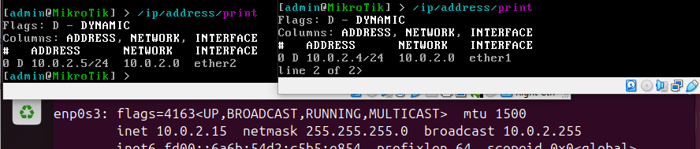

Netbox будет развернут в контейнере, так что для начала добавим в конфигурацию трансляцию портов.

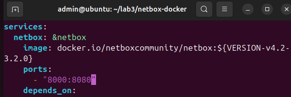

Запустим контейнер, который подкачает все необходимые зависимости.

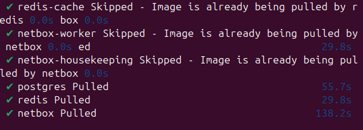

Создадим пользователя для доступа к web-интерфейсу.

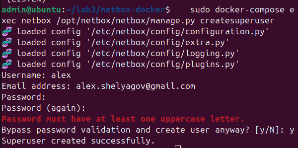

Netbox успешно поднялся в контейнере.

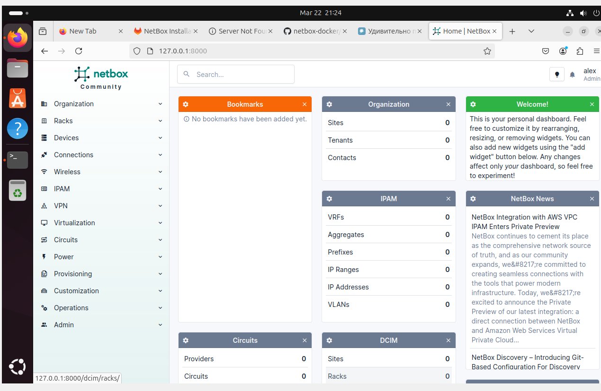

Добавим всю информацию об устройствах.

С помощью ansible выгрузим данные из Netbox в файл.

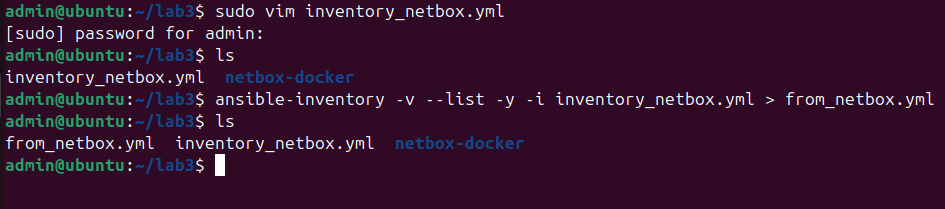

Убедимся в успешности выгрузки.

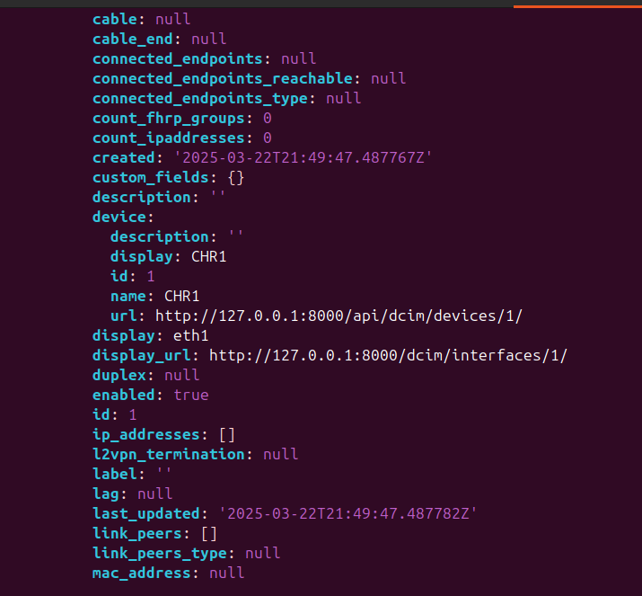

Создадим playbook для изменения IP и имен узлов.

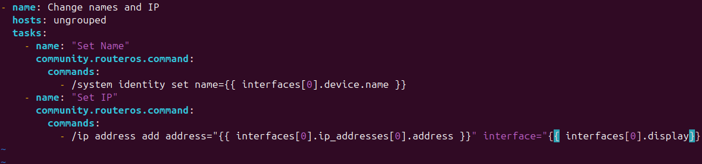

Запустим данный playbook.

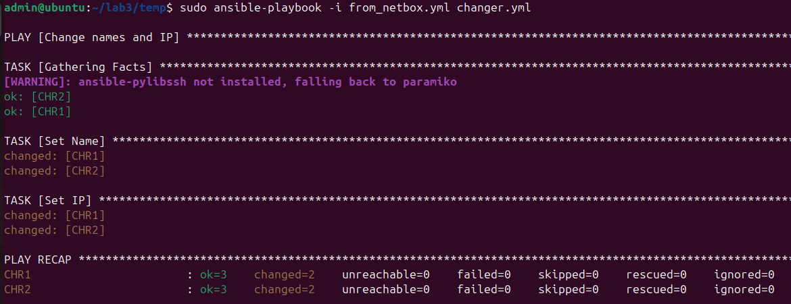

Заметим что playbook успешно выполнился, поменяв IP и имена на узлах.

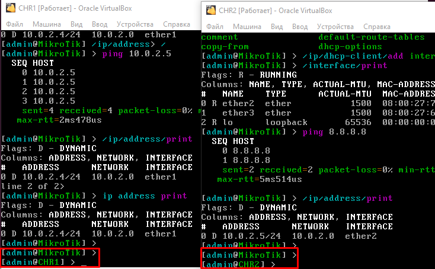

В окончании напишем playbook, котрорый добавит данные в Netbox.

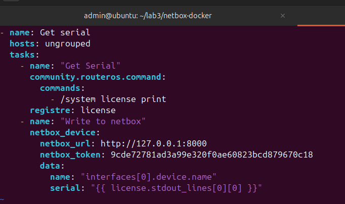

## Вывод

В результате лабораторной работы был развернут Netbox, с помощью которого была задокументирована система. Также, были созданны 2 playbook'а, работающие с данными из playbook'ов.
