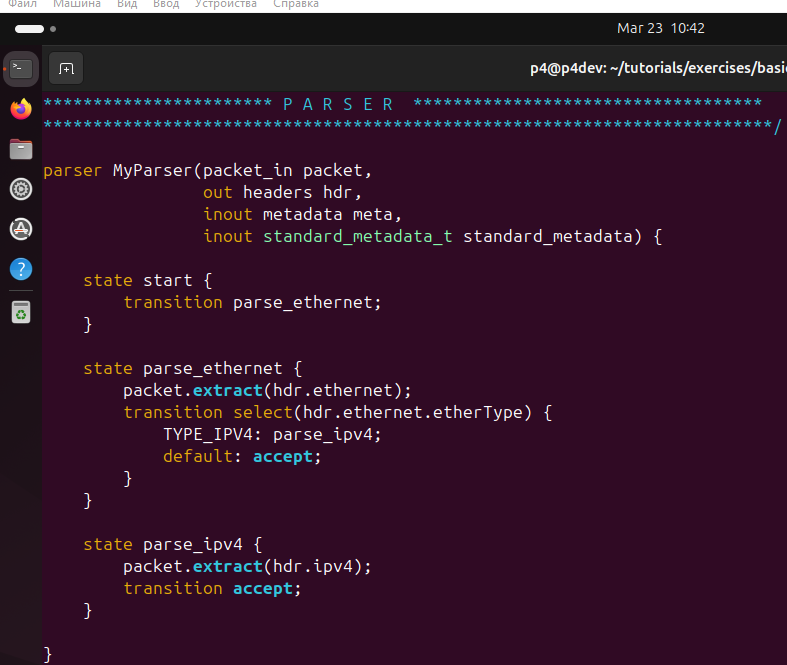

University: [ITMO University](https://itmo.ru/ru/)
Faculty: [FICT](https://fict.itmo.ru)
Course: [Network programming](https://github.com/itmo-ict-faculty/network-programming)
Year: 2024/2025
Group: K34212
Author: Shelyagov Alexey
Lab: Lab4
Date of create: 20.03.2025
Date of finished: 20.03.2025

## Лабораторная работа №4 "Базовая 'коммутация' и туннелирование используя язык программирования P4"

## Описание

В данной лабораторной работе ознакомится на практике с языком программирования P4, разработанным компанией Barefoot (ныне Intel) для организации процесса обработки сетевого трафика на скорости чипа. Barefoot разработал несколько FPGA чипов для обработки трафика которые были встроенны в некоторые модели коммутаторов Arista и Brocade.

## Цель работы

Изучить синтаксис языка программирования P4 и выполнить 2 задания обучающих задания от Open network foundation для ознакомления на практике с P4.

## Ход работы

Первым делом была установлена виртуальная машина для обучения работы с P4.

Затем, была поднята тестовая сеть с помощью mininet.

Убедимся, что пинги между узлами не идут.

Допишем в p4-файл логику работы с пакетами.

Убедимся в наличии связности между узлами. Теперь каждое устройство может пропинговать каждое.

Перейдем ко второму заданию. Проверим, что пересылка пакетов без тунелирования работает.

Изменим конфигурационный файл.

Попробуем отослать на третий узел пакет указав его IP, но прописав в адресате назначения в созданном нами заголовке id второго узла. Как можно заметить, в результате пакет было отослан только второму узлу.

## Вывод

В результате лабораторной работы было настроены  тунелирование в тестовой сети mininet с помощью языка P4.

